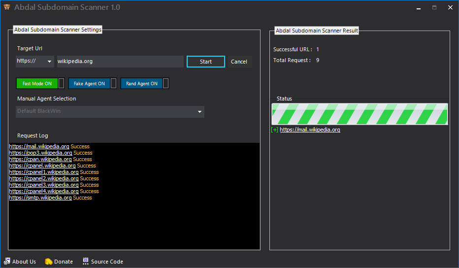

# **Abdal Subdomain Scanner**

## Screenshot

## Made For

A scanner to find subdomains of a site. This software is able to identify more than 220,000 subdomains.

**Requires**
> Visual Studio 2019 - Telerik WinForm - Chilkat - .NetFramework 4.7 or above
>

Features

- Support over 220,000 subdomain
 
## ❤️ Donation
> USDT:      TXLasexoQTjKMoWarikkfYRYWWXtbaVadB

> bitcoin:   19LroTSwWcEBY2XjvgP6X4d6ECZ17U2XsK

> For Iranian People -> MellatBank : 6104-3378-5301-4247

## Reporting Issues

If you are facing a configuration issue or something is not working as you expected to be, please use the **Abdal.Group@Gmail.Com** or **Prof.Shafiei@Gmail.com** . Issues on GitLab are also welcomed.

### About Programmer
Ebrahim Shafiei (EbraSha) (Ready to cooperate with international projects)
- Email : Prof.Shafiei@Gmail.com

## License
Abdal Subdomain Scanner is open-source software licensed under the [MIT license.](https://choosealicense.com/licenses/mit/)

## ⚠️ Legal disclaimer ⚠️

Usage of Abdal Subdomain Scanner for Spying targets without prior mutual consent is illegal. It's the end user's responsibility to obey all applicable local, state and federal laws. Developers assume no liability and are not responsible for any misuse or damage caused by this program.

